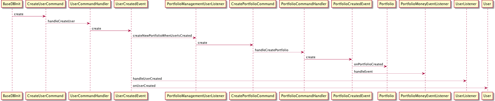

Axon MRI - Flow visualization tool
==================================

MRI /ˌɛm ɑr ˈaɪ/ helps you visualize flow of the code when using Axon Framework.

Installation
------------

	gradle jar

Usage
-----

1. Before executing this tool you need to have generated the classpath for your project.

	For Maven run:

		$ mvn dependency:build-classpath | grep -v "^\[.*\].*" | tr ':' '\n' | sort | uniq | tr '\n' ':' > this.classpath

	For Gradle add this to build.gradle:

		task showClasspath << {
    		it.println sourceSets.main.runtimeClasspath.collect { it.absolutePath }.join(':')
    	}

	and run

		$ gradle -q showClasspath > this.classpath

2. To print the Axon flow:

		java -jar build/libs/org.mri-VERSION.jar -m (--method-name) METHOD_NAME -s (--source-folder) SOURCE_FOLDERS --classpath-file CLASSPATH_FILE
    
		--classpath-file CLASSPATH_FILE     : file containing the classpath for the analyzed project
		-c (--classpath) CLASSPATH          : classpath for the analyzed project
        -f (--format) [DEFAULT | PLANTUML] : format of the output
		-m (--method-name) METHOD_NAME      : method name (can be a regexp) to print axon flow for
		-s (--source-folder) SOURCE_FOLDERS : source folder(s) for the analyzed project
		
Example
-------

Execute following from this project root directory:

	$ git clone https://github.com/AxonFramework/Axon-trader ../Axon-trader
	$ mvn -f ../Axon-trader/pom.xml dependency:build-classpath | grep -v "^\[.*\].*" | tr '\n' ':' > ../Axon-trader/this.classpath
	$ java -jar build/libs/org.mri-*.jar --classpath-file "../Axon-trader/this.classpath" -s ../Axon-trader -m createuser

Output:

	org.axonframework.samples.trader.webui.init.BaseDBInit.createuser(java.lang.String, java.lang.String)
        -> org.axonframework.samples.trader.api.users.CreateUserCommand.CreateUserCommand(org.axonframework.samples.trader.api.users.UserId, java.lang.String, java.lang.String, java.lang.String)
        -- [handler] --
          -> org.axonframework.samples.trader.users.command.UserCommandHandler.handleCreateUser(org.axonframework.samples.trader.api.users.CreateUserCommand)
                -> org.axonframework.samples.trader.api.users.UserCreatedEvent.UserCreatedEvent(org.axonframework.samples.trader.api.users.UserId, java.lang.String, java.lang.String, java.lang.String)
                -- [listeners] --
                  -> org.axonframework.samples.trader.orders.command.PortfolioManagementUserListener.createNewPortfolioWhenUserIsCreated(org.axonframework.samples.trader.api.users.UserCreatedEvent)
                        -> org.axonframework.samples.trader.api.portfolio.CreatePortfolioCommand.CreatePortfolioCommand(org.axonframework.samples.trader.api.orders.trades.PortfolioId, org.axonframework.samples.trader.api.users.UserId)
                        -- [handler] --
                          -> org.axonframework.samples.trader.orders.command.PortfolioCommandHandler.handleCreatePortfolio(org.axonframework.samples.trader.api.portfolio.CreatePortfolioCommand)

                  -> org.axonframework.samples.trader.query.users.UserListener.handleUserCreated(org.axonframework.samples.trader.api.users.UserCreatedEvent)

                  -> org.axonframework.samples.trader.users.command.User.onUserCreated(org.axonframework.samples.trader.api.users.UserCreatedEvent)

Plant UML support
-------

Use '-f (-format)' option to visualize your flow using sequence diagram in Plant UML format.

Run:

	$ java -jar build/libs/org.mri-*.jar --classpath-file "../Axon-trader/this.classpath" -s ../Axon-trader/ -m createuser -f plantuml

Text Output:

	@startuml
	BaseDBInit -> CreateUserCommand: create
	CreateUserCommand --> UserCommandHandler: handleCreateUser
	UserCommandHandler -> UserCreatedEvent: create
	UserCreatedEvent --> PortfolioManagementUserListener: createNewPortfolioWhenUserIsCreated
	PortfolioManagementUserListener -> CreatePortfolioCommand: create
	CreatePortfolioCommand --> PortfolioCommandHandler: handleCreatePortfolio
	PortfolioCommandHandler -> PortfolioCreatedEvent: create
	PortfolioCreatedEvent --> Portfolio: onPortfolioCreated
	PortfolioCreatedEvent --> PortfolioMoneyEventListener: handleEvent
	UserCreatedEvent --> UserListener: handleUserCreated
	UserCreatedEvent --> User: onUserCreated
	@enduml
	
Run (requires plantuml as shell command):

	$ java -jar build/libs/org.mri-*.jar --classpath-file "../Axon-trader/this.classpath" -s ../Axon-trader/ -m createuser -f plantuml | plantuml -tpng -pipe > output.png

Image output:

